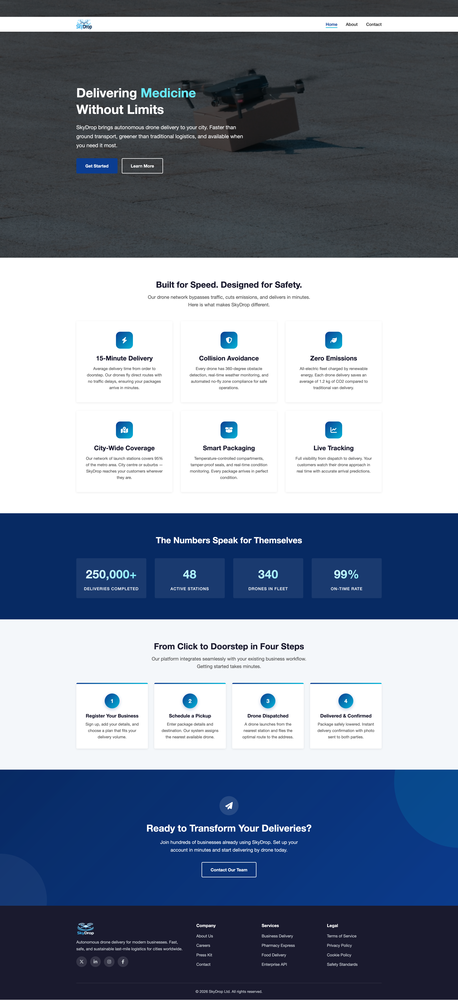
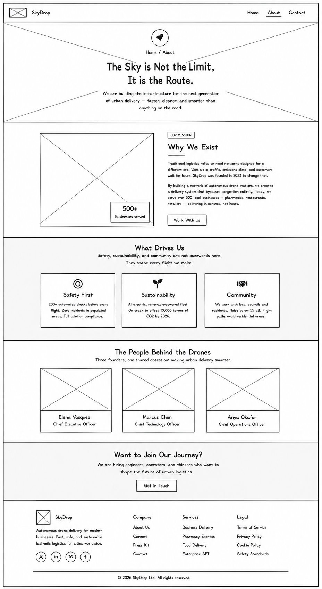

# Test Project Outline – Module A – Design Implementation

## Competition time

3 hours

## Introduction

**SkyDrop** is a startup that operates autonomous drone delivery stations across major cities, handling last-mile delivery for restaurants, pharmacies, and retailers.

After securing Series B funding, SkyDrop needs a marketing website to attract business partners in new cities. A design team started the project and completed a full mockup for the Home page and a wireframe for the About page — but the project ran behind schedule and the business needs to launch now. The Contact page was never designed; only its requirements were documented.

## General Description of Project and Tasks

The website must consist of three pages: **Home**, **About**, and **Contact**. The design of all pages should be aligned with the brand identity.

- Implement the **Home** page exactly as shown in the provided mockup.
- Interpret the **About** page from the provided wireframe, applying the brand identity.
- Design the **Contact** page yourself from the documented requirements, keeping visual consistency with the other pages.

The client provides media, icons, brand tokens, and all page text. Use the provided assets as specified in each section. Images in `assets/img/` may be used as appropriate for design implementation. All page text is in `assets/texts.txt`.

The stack is **HTML**, **CSS**, and **JavaScript**. You may optionally use the provided Tailwind or Bootstrap CSS in `assets/vendor/`, or write your own CSS. No JavaScript UI frameworks (React, Vue, etc.) and no build step or build tooling are allowed. Page interactivity must be vanilla JavaScript. Bootstrap’s own bundle is permitted.

All HTML and CSS must be valid HTML5 and CSS3.

The website must be responsive and support at least the following breakpoints: **480px**, **768px**, and **1024px**. The desktop layout must scale cleanly on large screens, including 4K displays. Sample layouts for 480px and 768px are available in `assets/samples/480px.png` and `assets/samples/768px.png`.

## Requirements

The goal of the website is to promote SkyDrop to potential business partners and help them get in touch. Visitors must be able to understand the service, learn about the company, and submit an enquiry.

### Brand Identity

#### Colours

| Token         | Value     | Usage                                                      |
| ------------- | --------- | ---------------------------------------------------------- |
| Primary       | `#0b3d91` | Main brand colour — buttons, links, header accents         |
| Primary Light | `#1a5bc4` | Hover states                                               |
| Primary Dark  | `#082a63` | Gradients, dark backgrounds                                |
| Accent        | `#00b4d8` | Secondary highlights, gradient endpoints, icon backgrounds |
| Accent Light  | `#7dd8e8` | Subtle accents                                             |
| Dark          | `#1a1a2e` | Footer background, dark text headings                      |
| Text          | `#2d2d2d` | Body text                                                  |
| Text Light    | `#555555` | Secondary text, descriptions                               |
| White         | `#ffffff` | Backgrounds, light text on dark                            |
| Light         | `#f4f7fa` | Section backgrounds, input fields                          |
| Border        | `#dde3ea` | Borders, dividers                                          |

These colours are also provided as CSS custom properties in `assets/patterns.css`.

#### Social brand colours (for hover states)

| Platform    | Colour    |
| ----------- | --------- |
| X (Twitter) | `#000000` |
| LinkedIn    | `#0a66c2` |
| Instagram   | `#e4405f` |
| Facebook    | `#1877f2` |

#### Design elements

- Border radius: `4px` across all elements (sharp corners)
- Font: system font stack (Segoe UI, Roboto, Helvetica Neue, Arial, sans-serif)

### Provided Assets

- Logo in two versions: `assets/img/logo_dark.png` (for light backgrounds) and `assets/img/logo_light.png` (for dark backgrounds)
- FontAwesome provided in `assets/fonts/fontawesome.min.css`
- A selection of images in `assets/img/` — use whichever are appropriate for design implementation
- Favicon sets in `assets/img/favicon-dark/` and `assets/img/favicon-light/` — use whichever matches your theme
- All page text in `assets/texts.txt`
- Optional CSS libraries in `assets/vendor/`: Tailwind Play browser build (`assets/vendor/tailwind/tailwind.js`, no build step) and Bootstrap 5.3 (`assets/vendor/bootstrap/bootstrap.min.css` + `assets/vendor/bootstrap/bootstrap.bundle.min.js`)

### Home Page

Implement the provided mockup as designed. Refer to `assets/samples/home.png` for the full page layout and `assets/samples/home.mp4` for animations and interaction behaviour.

#### Sticky Header

- Logo left, nav links right (Home, About, Contact)
- Fixed on scroll, white background, subtle shadow

#### Hero (Video Background)

- Full-screen looping video background with dark overlay
- Heading with rotating text: cycles "Medicine" → "Food" → "Parcels" (vertical slide-up animation)
- Paragraph + two buttons side by side:
  - Primary filled button: "Get Started" → Contact
  - Outline light button: "Learn More" → About
- Buttons use the site-wide hover animation

#### Features (6 cards)

- 3-column grid
- Each card: rounded-square icon (primary→accent gradient bg), heading, description
- Hover: card lifts, deeper shadow, accent bottom border appears, icon scales up

| Card | Icon                | Heading             |
| ---- | ------------------- | ------------------- |
| 1    | `fa-bolt`           | 15-Minute Delivery  |
| 2    | `fa-shield-halved`  | Collision Avoidance |
| 3    | `fa-leaf`           | Zero Emissions      |
| 4    | `fa-map-marked-alt` | City-Wide Coverage  |
| 5    | `fa-box-open`       | Smart Packaging     |
| 6    | `fa-chart-line`     | Live Tracking       |

#### Stats (Parallax)

- CSS parallax background image (`assets/img/parallax-sky.jpg`) + dark overlay
- 4 stat items in a row, each in a semi-transparent glass card
- Numbers: gradient text fill (white→accent), animate from 0 to target on scroll (eased)
- Labels: uppercase, letter-spacing

#### How It Works (4 steps)

- 4 cards in a row, light background
- Each card: gradient accent bar on top edge, numbered circle (primary→accent gradient + drop shadow), heading, description
- Hover: card lifts

#### CTA

- Gradient background (primary-dark → primary → accent)
- Decorative translucent circles in background
- Frosted-glass icon badge centred above heading (`fa-paper-plane`)
- Paragraph + single outline button (inverts on hover)

#### Footer

- Dark background (`#1a1a2e`)
- Column 1: light logo, description, social icons (X, LinkedIn, Instagram, Facebook)
- Columns 2–4: Company, Services, Legal — each with heading + link list
- Social icons: `fa-x-twitter`, `fa-linkedin-in`, `fa-instagram`, `fa-facebook-f`
- Copyright bar at bottom with a dynamic year (see Site-wide Requirements)

### About Page

A wireframe is provided in `assets/samples/about-wireframe.png`. Visual styling (colours, spacing, effects) is your decision — keep it consistent with the Home page and brand.

All content and images for this page are provided in `assets/texts.txt` and `assets/img/`.

#### Page hero

Gradient background, decorative circles, frosted icon badge (`fa-rocket`), breadcrumb.

#### Mission

Two-column — image with floating stat overlay card on left, tag label + heading with accent underline + paragraphs + CTA button on right.

#### Values

Dark parallax background, 3 cards with icons:

| Card | Icon           | Heading        |
| ---- | -------------- | -------------- |
| 1    | `fa-bullseye`  | Safety First   |
| 2    | `fa-seedling`  | Sustainability |
| 3    | `fa-handshake` | Community      |

#### Team

3 member cards with photos, name, title.

#### CTA and Footer

Match the Home page.

### Contact Page

No mockup or wireframe is provided. Design this page yourself while maintaining visual consistency with the other pages.

Body copy, contact details, and alternative heading options for this page are in `assets/texts.txt`.

#### Contact details

The page must show:

- Head Office address
- Email addresses
- Phone number
- Operations hours

#### Contact form

- First Name (required)
- Last Name (required)
- Email Address (required, must validate format)
- Phone Number (optional)
- Subject dropdown (required): Request a Demo, Pricing & Plans, Partnership Enquiry, Technical Support, Press & Media, Other
- Message textarea (required)
- Submit button
- Client-side validation with visual feedback for invalid fields
- Success state on submission

#### Map, social, CTA, navigation, and footer

- Map with location
- Social media links
- CTA section
- Navigation and footer consistent with other pages

### Site-wide Requirements

- Mobile hamburger navigation
- Active page in navigation must be visually indicated and not be a link
- ARIA labels must be present on all interactive elements (navigation links, buttons, form controls, social/icon links)
- Social hover states must use each platform’s brand colour
- All buttons must use a left-to-right fill sweep animation on hover with colour inversion
- All pages must include the provided favicon
- Copyright year in the footer must be set dynamically with JavaScript

## Assessment

The website will be assessed in a desktop browser at the required breakpoints (480px, 768px, 1024px) and on a large desktop window.

Colour contrast will be checked with WAVE. Pages must have no WAVE contrast errors.

HTML and CSS will be checked with the W3C Markup and CSS validators. Pages must have no validation errors (warnings may be ignored).

## Mark distribution

| WSOS SECTION | Description                            | Points |
| ------------ | -------------------------------------- | ------ |
| 1            | Work organization and self-management  | 1      |
| 2            | Communication and interpersonal skills | 1      |
| 3            | Design Implementation                  | 13     |
| 4            | Front-End Development                  | 2      |
| **Total**    |                                        | 17     |

This is a client-side module; WSOS section 5 (Back-End Development) is not used.
